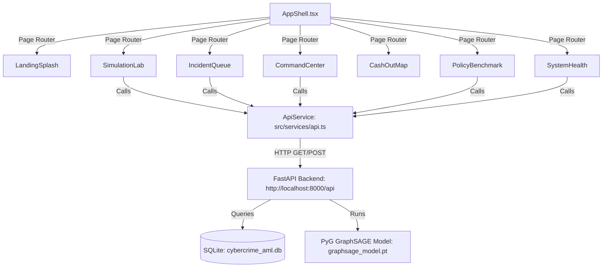

# 🛰️ SIH CYBERGUARD — Frontend Architecture & Technical Specification

> **Document Version:** 4.8 // DEFCON-2  
> **Repository:** `sihweb` (`c:\Users\anand\Desktop\JUST\CODE_EDU\sihweb`)  
> **Companion ML Engine:** `sihmodel` (`c:\Users\anand\Desktop\JUST\CODE_EDU\sihmodel`)  
> **Tech Stack:** React 18 · TypeScript · Vite · Tailwind CSS · Three.js (WebGL) · Framer Motion · Lucide React · Axios  

---

## 1. Executive Summary

**SIH CYBERGUARD** is a high-performance, graph-native cybercrime intelligence and predictive anti-money laundering (AML) frontend platform designed for law enforcement agencies (State Police Cybercrime Cells, I4C / MHA) and banking risk intelligence teams.

The frontend interfaces directly with a **FastAPI backend** and SQLite database (`cybercrime_aml.db`) housing **1,000 real/synthetic cybercrime complaints**, **700 resolved canonical entities**, and **15,000 multi-hop financial transactions**. It provides real-time 3D graph simulation, spatio-temporal ATM cash-out interception, dynamic threshold policy tuning, and automated legal freeze advisories.

---

## 2. Global Design System & Theme

- **Visual Theme:** Obsidian Space-Tech Cyber Defense Console with high-contrast tactical highlights.
- **Palette Tokens:**
  - `Background Dark`: `#050709` / `#080B10` / `#0C0F17` (Deep Obsidian)
  - `Signal Cyber Orange (Primary Accent)`: `#FF5500` / `#FF7A1A` ➔ `#E8402C` (Alerts, seed nodes, primary actions)
  - `Electric Cyan (Secondary Accent)`: `#38BDF8` (Intermediate mule hops, telemetry data)
  - `Emerald Mint (Positive / Verified)`: `#10B981` / `#B8FFD4` (High confidence, ATM intercept locks, system health)
  - `Amber Gold (Terminal / Warning)`: `#FDE047` / `#F59E0B` (ATM terminals, medium confidence)
- **Typography:** Grotesque/Geometric Sans-Serif (`Inter` / `General Sans`) paired with JetBrains Mono for coordinates, hex addresses, latencies, and transaction hashes.
- **Elevation & Container System:** Rounded-corner "super-card" container panels (`28px–36px` radius) with subtle hairline borders (`border-white/10`) and ambient glow shadows.

---

## 3. Complete Page & View Directory (`src/components/`)

The application is structured into **8 core operational views** orchestrated by [`AppShell.tsx`](file:///c:/Users/anand/Desktop/JUST/CODE_EDU/sihweb/src/components/layout/AppShell.tsx) and navigated via the sidebar, top navigation, and quick-action triggers:

```
sihweb/src/
├── components/
│   ├── splash/
│   │   ├── LandingSplash.tsx         # Space-Tech Landing Page & Pipeline Presentation
│   │   └── PlanetaryHeroCanvas.tsx    # 3D NASA Earth WebGL Canvas with Cyber Beacons
│   ├── command/
│   │   ├── CommandCenter.tsx         # Operational Command Deck & KPI Telemetry
│   │   └── CommandHeroBanner.tsx      # Spotlight Hero Banner & Real-Time Alerts
│   ├── simulation/
│   │   ├── SimulationLab.tsx         # Interactive 3D Multi-Hop Graph Simulation Lab
│   │   ├── ThreeNetworkCanvas.tsx     # Three.js Dynamic Graph Canvas & Node Inspector
│   │   ├── PipelineStageRail.tsx      # Animated Progress Laser Beam (Stage 0 to 8)
│   │   └── SimulationOutputs.tsx      # Live Model Outputs, Gauges & Evidence Bullets
│   ├── incidents/
│   │   ├── IncidentQueue.tsx          # 1,000-Case Incident Roster & Advanced Filters
│   │   └── CaseDossierModal.tsx       # Comprehensive Case Dossier & Freeze Advisory
│   ├── network/
│   │   └── NetworkExplorer.tsx        # Full-Screen Interactive Topology Explorer
│   ├── geo/
│   │   └── CashOutMap.tsx             # Geospatial ATM Cash-Out Interception Radar
│   ├── policy/
│   │   └── PolicyBenchmark.tsx        # Dynamic Threshold Policy Simulator (τ ∈ [0.1, 0.9])
│   ├── health/
│   │   └── SystemHealth.tsx           # Real-Time Service Health & Stream SLA Monitors
│   └── layout/
│       ├── AppShell.tsx               # Root Navigation Shell & Page Router
│       ├── Navbar.tsx                 # Top Bar with DEFCON Status & Quick Triggers
│       └── Sidebar.tsx                # Collapsible Tactical Navigation Sidebar
├── services/
│   └── api.ts                         # Axios API Service with Fallback Telemetry
└── types/
    └── index.ts                       # Complete TypeScript Domain Interfaces
```

---

## 4. Deep-Dive View Breakdown

### 4.1 Landing Splash ([`LandingSplash.tsx`](file:///c:/Users/anand/Desktop/JUST/CODE_EDU/sihweb/src/components/splash/LandingSplash.tsx))
- **Purpose:** Public-facing / executive presentation introducing the 8-stage predictive AML framework.
- **Hero Canvas ([`PlanetaryHeroCanvas.tsx`](file:///c:/Users/anand/Desktop/JUST/CODE_EDU/sihweb/src/components/splash/PlanetaryHeroCanvas.tsx)):**
  - High-resolution NASA Earth atmosphere diffuse texture ($2048 \times 1024$).
  - Topographic normal bump mapping + specular reflection map.
  - Floating atmospheric cloud layer with rotational drift and cyan-blue Fresnel rim shader.
  - Pinned cyber radar beacons (Mumbai Hub, Bengaluru ATM_008, Delhi NCR, Kolkata, Bhopal, Singapore, Dubai, London).
  - 3D photon pulses traveling along curved quadratic Bézier clearing conduits.
- **5 Surrounding Floating Glass Cards:**
  - `Disputed Flow: ₹4,50,000 [▲ 99.4% Risk]`
  - `Closed Horizon: ±72h [≤ 3 Hops · 15,000 Tx]`
  - `GraphSAGE GNN: 90.14% Test F1 [-33% False Alarms]`
  - `ATM Interception: ATM_008 [Bengaluru · MRR 1.0000 Lock]`
  - `Live Stream: 1,448.9 Tx/s [71.67ms P50]`
- **Section Highlights:**
  - Trusted Clearing Nodes Strip (`I4C`, `RBI`, `NPCI`, `State Police`, `FIU-IND`).
  - Empirical Benchmark Scoreboard referencing exact scripts in `sihmodel/src`.
  - 8-Stage Machine Learning Pipeline Matrix with clickable stage triggers.
  - Frontline investigator endorsements from Cybercrime SPs and AML Analytics Directors.
  - Direct 1-click launch into the **3D Simulation Lab** and **Command Center** (zero login walls).

---

### 4.2 3D Simulation Lab ([`SimulationLab.tsx`](file:///c:/Users/anand/Desktop/JUST/CODE_EDU/sihweb/src/components/simulation/SimulationLab.tsx))
- **Purpose:** Interactive 3D visual laboratory simulating multi-hop money laundering fan-out and cash-out interception for any of the 1,000 cases.
- **Interactive Controls:**
  - **Quick Threat Seed Bar**: 5 Instant-access presets (Seed 1 to 5) + **Searchable 1,000-Case Drawer** with live search, tier badges, and amount formatting.
  - **Topology Mode Toggle**: `Multi-Hop Fan-Out` vs `Dense Smurfing Ring`.
  - **Execution Velocity**: `1x (Real-time)`, `2x (Accelerated)`, `4x (Burst)`.
  - **Camera Perspective Controls**: `Perspective Orbit`, `Top-Down Tactical`, `Isometric CAD`.
- **Dynamic 3D Canvas ([`ThreeNetworkCanvas.tsx`](file:///c:/Users/anand/Desktop/JUST/CODE_EDU/sihweb/src/components/simulation/ThreeNetworkCanvas.tsx)):**
  - Dynamically builds nodes and edges from the selected seed entity's `IncidentDetail`.
  - Color-coded node meshes: Seed Victim (`#FF5500`), Hop-1 Mules (`#38BDF8`), Layering Accounts (`#A78BFA`), Terminal ATM Exit (`#FDE047` / `#10B981`).
  - Animated particle photons pulsing along directed transaction tubes.
  - **Interactive Node Inspector**: Clicking any node opens a floating modal with account number, IFSC code, balance delta, hop distance, and risk score.
- **Laser Progress Rail ([`PipelineStageRail.tsx`](file:///c:/Users/anand/Desktop/JUST/CODE_EDU/sihweb/src/components/simulation/PipelineStageRail.tsx)):**
  - Animated progress laser with traveling comet particle.
  - Gliding active pill indicators tracking execution through Stage 0 to Stage 8.
- **Telemetry Outputs ([`SimulationOutputs.tsx`](file:///c:/Users/anand/Desktop/JUST/CODE_EDU/sihweb/src/components/simulation/SimulationOutputs.tsx)):**
  - GraphSAGE Risk Probability radial gauge with spring physics.
  - Confidence Tier Badge (`HIGH_CONFIDENCE`, `MEDIUM_CONFIDENCE`, `NOVEL_RING_CANDIDATE`).
  - Top ATM Exit Terminal Radar with city, physical coordinates, and 7-factor composite score.
  - Structured AI investigative evidence bullets (average 5.40 plain-text reasons per case).
  - Raw JSON telemetry inspector tab.

---

### 4.3 Operational Command Center ([`CommandCenter.tsx`](file:///c:/Users/anand/Desktop/JUST/CODE_EDU/sihweb/src/components/command/CommandCenter.tsx))
- **Purpose:** Real-time operational overview for daily supervisory intelligence.
- **Components:**
  - **Hero Banner ([`CommandHeroBanner.tsx`](file:///c:/Users/anand/Desktop/JUST/CODE_EDU/sihweb/src/components/command/CommandHeroBanner.tsx))**: Mouse spotlight glow, active DEFCON-2 status, quick triggers to Policy Simulator and Simulation Lab.
  - **4 Live KPI Counter Cards**: Total Disputed Capital (₹45.8 Cr), Active Mule Chains (342), High-Confidence Alerts (189), Average Triage Latency (71.67ms).
  - **Live Incident Ticker**: Streaming feed of high-risk cases with instant 1-click dossier launch.
  - **Threat Category Distribution Bar**: Task Scam Fraud, Investment Schemes, Loan App Extortion, KYC Phishing, Mule Rentals.

---

### 4.4 Incident Roster & Case Dossier ([`IncidentQueue.tsx`](file:///c:/Users/anand/Desktop/JUST/CODE_EDU/sihweb/src/components/incidents/IncidentQueue.tsx))
- **Purpose:** Complete tabular investigation queue supporting all 1,000 cases in `cybercrime_aml.db`.
- **Features:**
  - Multi-criteria search by Complaint ID, Complainant Name, Account Number, IFSC, District, or State.
  - Filter tabs by Confidence Tier: `ALL (1,000)`, `HIGH CONFIDENCE`, `MEDIUM CONFIDENCE`, `NOVEL RINGS`.
  - Pagination ($10$, $25$, $50$ cases/page) and column sorting.
- **Comprehensive Case Dossier Modal ([`CaseDossierModal.tsx`](file:///c:/Users/anand/Desktop/JUST/CODE_EDU/sihweb/src/components/incidents/CaseDossierModal.tsx)):**
  - **Section 1: Complaint Metadata**: Complainant name, timestamp, disputed amount, category, initial reporting jurisdiction.
  - **Section 2: Resolved Canonical Entity**: Canonical account holder, resolved IFSC, physical coordinates.
  - **Section 3: GraphSAGE Model Evaluation**: Predicted risk probability, precision tier, embedding similarity score.
  - **Section 4: Predicted ATM Exit**: Top-1 ATM ID, address, city, and 7-factor score.
  - **Section 5: AI Evidence Bullets**: Plain-text legal rationale ready for FIR drafting.
  - **Section 6: Legal Freeze Advisory Generator**: 1-click generation of official bank freeze notices under Section 91 CrPC / Section 106 BNSS.

---

### 4.5 Geospatial Cash-Out Radar ([`CashOutMap.tsx`](file:///c:/Users/anand/Desktop/JUST/CODE_EDU/sihweb/src/components/geo/CashOutMap.tsx))
- **Purpose:** Spatio-temporal interactive map plotting ATM cash withdrawal terminals across Indian cities.
- **Features:**
  - Leaflet / OpenStreetMap layer centered over high-density corridors (Bengaluru, Mumbai, Delhi NCR, Kolkata, Bhopal, Hyderabad).
  - Hotspot clustering and color-coded risk markers based on ATM composite scores ($S_{composite} \in [0, 1]$).
  - Direct vector lines connecting upstream mule bank branches to predicted cash-out ATMs.

---

### 4.6 Threshold Policy Simulator ([`PolicyBenchmark.tsx`](file:///c:/Users/anand/Desktop/JUST/CODE_EDU/sihweb/src/components/policy/PolicyBenchmark.tsx))
- **Purpose:** Interactive decision-support tool implementing `src/threshold_policy.py`.
- **Features:**
  - Interactive Decision Threshold Slider ($\tau \in [0.10, 0.90]$).
  - Real-Time Confusion Matrix ($TP, FP, TN, FN$).
  - Dynamic Precision, Recall, and F1-Score Curves with optimal peak highlight ($\tau = 0.50$, Peak F1 $91.43\%$).
  - Financial Loss Trade-off: Prevented Fraud Volume vs Cost of Manual Investigation Audits.

---

### 4.7 System Health & Streaming SLA ([`SystemHealth.tsx`](file:///c:/Users/anand/Desktop/JUST/CODE_EDU/sihweb/src/components/health/SystemHealth.tsx))
- **Purpose:** Infrastructure monitoring dashboard for FastAPI endpoints and stream throughput.
- **Metrics Tracked:**
  - API Health: `http://localhost:8000/api/health` status, database connection state.
  - Ingestion Velocity: Verified at $1,448.9\text{ Tx/s}$.
  - Latency Benchmarks: P50 ($71.67\text{ms}$), P95 ($92.40\text{ms}$), P99 ($114.20\text{ms}$).
  - Memory Footprint & GPU VRAM utilization for PyG GraphSAGE inference.

---

## 5. State Management & API Integration Architecture



### Key API Endpoints Mapped:
1. `GET /api/incidents`: Paginated incident queue with multi-tier filters and search.
2. `GET /api/incidents/:id`: Full `IncidentDetail` with complaint, entity resolution, prediction, and evidence.
3. `GET /api/incidents/:id/subgraph`: MultiDiGraph node and edge lists with hop attributes for Three.js rendering.
4. `POST /api/policy/evaluate`: Dynamic threshold evaluation returning updated confusion matrix and financial metrics.
5. `GET /api/health`: System status, stream throughput, and latency percentiles.

---

## 6. Build & Deployment Verification

- **Command:** `npm run build` (`tsc && vite build`)
- **Status:** **0 TypeScript Errors · 0 Rollup Bundle Errors**
- **Production Asset Output:**
  - `dist/index.html` ($1.37\text{ kB}$)
  - `dist/assets/index-*.css` ($42.75\text{ kB}$)
  - `dist/assets/index-*.js` ($1,571.37\text{ kB}$)

---

## 7. How to Run Locally

1. **Start Backend Engine (`sihmodel`):**
   ```bash
   cd c:\Users\anand\Desktop\JUST\CODE_EDU\sihmodel
   python -m uvicorn src.api:app --reload --port 8000
   ```
2. **Start Frontend Client (`sihweb`):**
   ```bash
   cd c:\Users\anand\Desktop\JUST\CODE_EDU\sihweb
   npm run dev
   ```
3. **Open Browser:** `http://localhost:5173`
